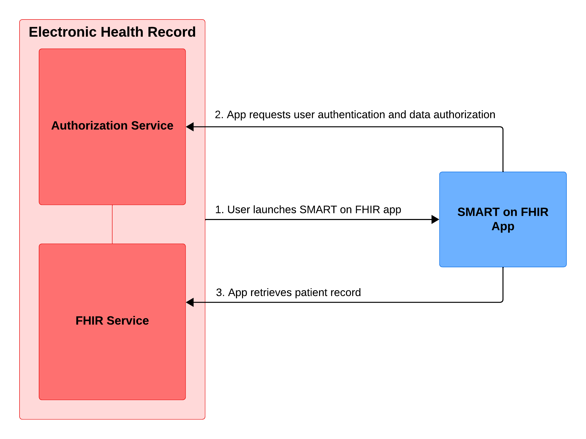

# the-simplest-SMART-on-FHIR-app-ever
Written in less than 40 lines of code, this might be the simplest SMART on FHIR app ever.

SMART on FHIR, despite its acronyms and jargon, is just a healthcare-specific adoption of two technologies that most developers are already familiar with: JSON and OAuth 2.0 / OIDC. [FHIR](https://www.hl7.org/fhir/R4/) is the data and API standard for exchanging patient records (the data being most commonly represented in JSON), and [SMART](https://smarthealthit.org/) is a slightly modified implementation of OAuth 2.0 / OIDC for securing those APIs. Mash up these two acronyms, and you get a production-ready standard for gaining access to healthcare APIs and exchanging data with other players in the industry.

One of the most popular use cases for SMART on FHIR is building a feature or visualization an electronic health record doesn't otherwise offer that users can access with *one* click. Yes, *one* click. Because SMART on FHIR applications piggyback off of the electronic health record for user authentication and access to patient data, they can prove to be easy additions to existing workflows. Furthermore, a SMART on FHIR application can be displayed inside the existing electronic health record window instead of forcing users to juggle two windows on screen.

The point of this article is to show you the simplest SMART on FHIR application that users can access in one click, and encourage you to think about how a SMART on FHIR app might suit your digital health initiatives. Try looking at the [public SMART on FHIR gallery](https://gallery.smarthealthit.org/apps/featured) for inspiration. Now, before you jump to the code snippet, have a look at this diagram to see how the app works:

Three high-level steps are playing out in this diagram. Firstly, a user presses a button inside their electronic health record to open the SMART on FHIR application for a chosen patient. Secondly, the SMART on FHIR app will confirm the user's identity with the electronic health record and receive authorization to access patient data. Finally, the SMART on FHIR application will retrieve the chosen patient's relevant information, do some ✨magic✨, and display the feature or visualization to the patient.

As promised, here's the simplest SMART on FHIR app ever (happy to be proven wrong if you have another example). Unfortunately, it offers no ✨magic✨ or fancy end result. It simply prints the raw JSON of the chosen patient's demographic information to the browser.

A few assumptions should be confirmed before blindly copying and pasting this code:
- You have a recent version of [Python](https://www.python.org/downloads/) installed, know how to install dependencies using pip, and start up a Flask application
- You have a SMART on FHIR server available to test this app against

If you find yourself stuck and need any assistance, feel free to contact me!